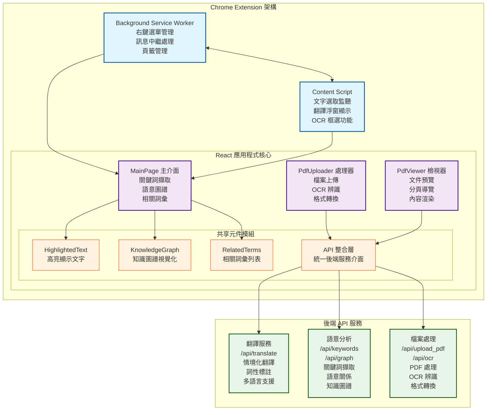
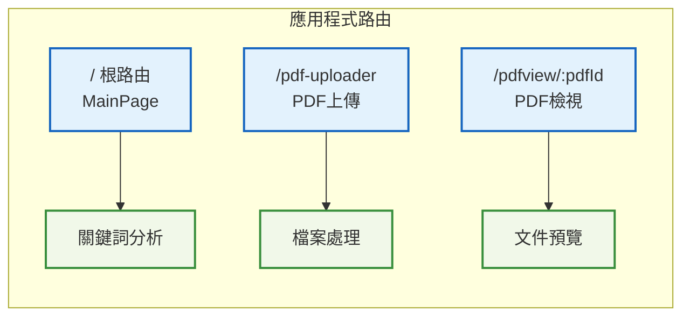
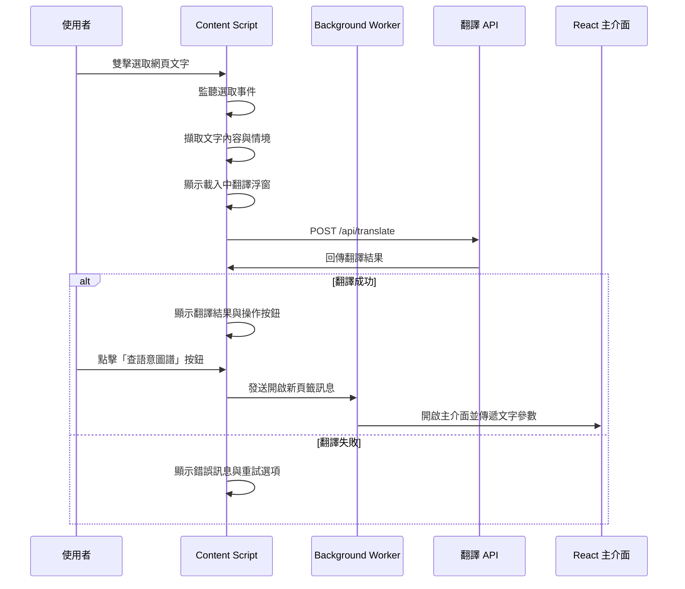
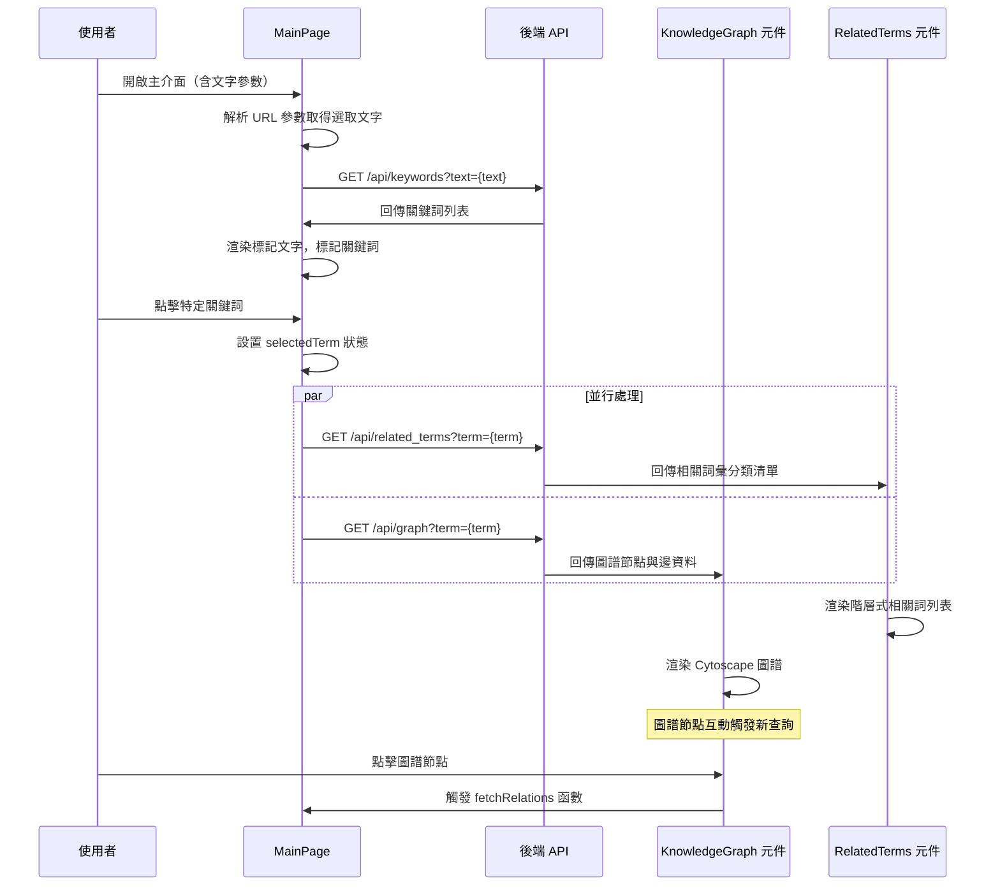
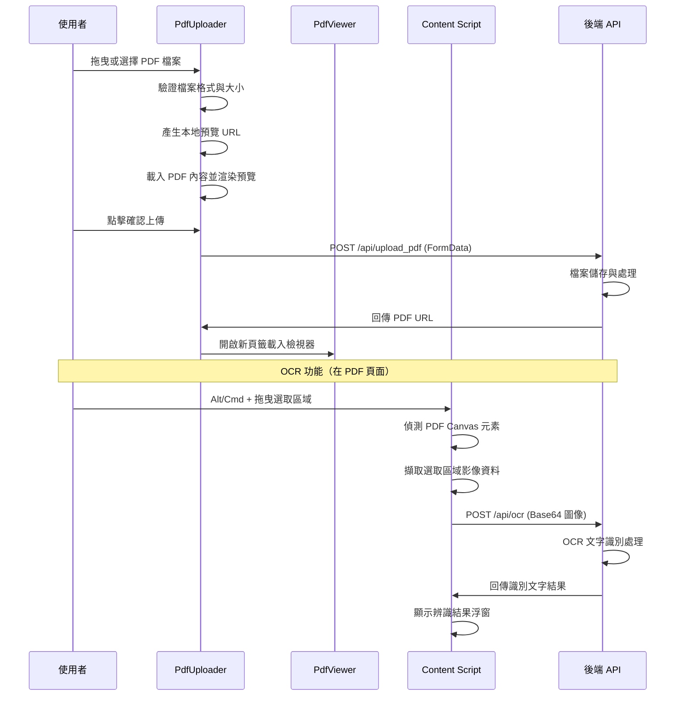
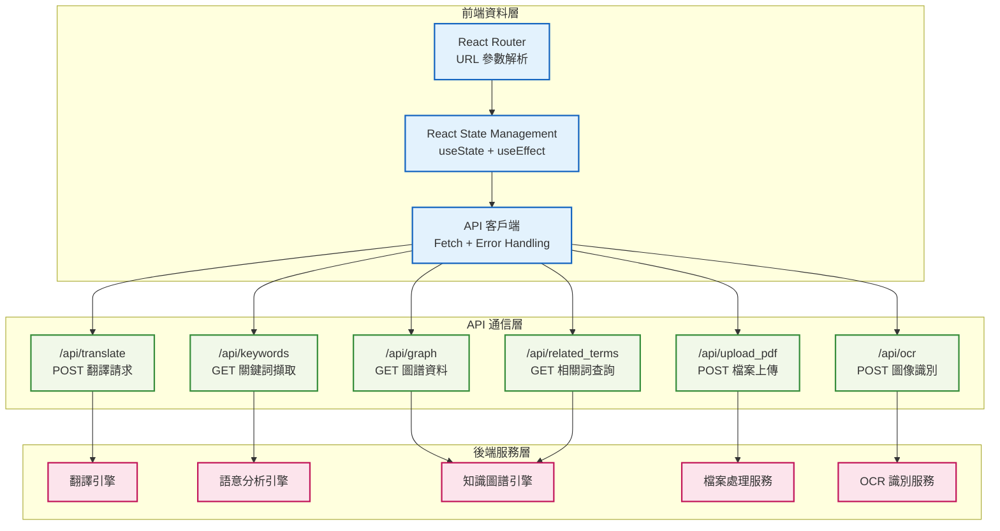
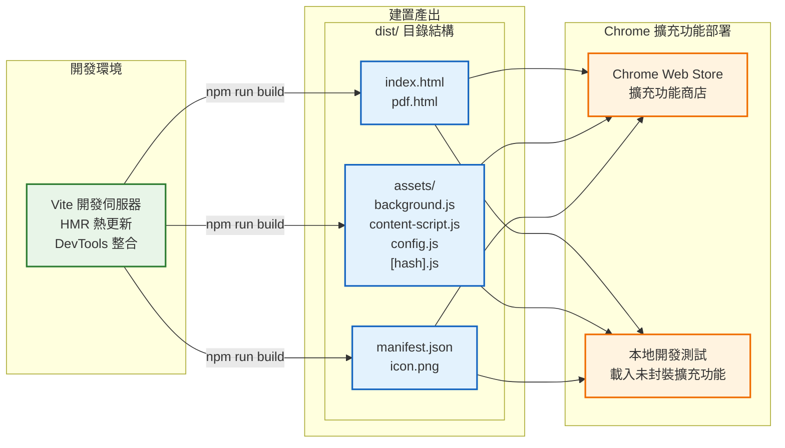

# Lexilight 翻譯器技術文件

## 1. 系統概述

此前端系統主要功能為提供語義增強的翻譯服務。系統採用 React 19 + TypeScript 前端技術棧，整合 Material-UI 設計系統，透過 Chrome Extension API 實現無縫的網頁文字翻譯體驗。

### 1.1 主要功能

- **即時翻譯引擎**：雙擊選取網頁文字即可獲得情境化翻譯結果
- **語意圖譜視覺化**：使用 Cytoscape.js 繪製詞彙關係網路
- **PDF 檔案處理**：支援檔案上傳、OCR 文字辨識及分頁預覽
- **跨網域整合**：完整 Chrome Extension 權限管理與安全通訊
- **知識圖譜查詢**：基於後端 API 的語義關係探索

### 1.2 技術架構概覽

系統採用典型的 Chrome Extension 架構設計，包含 Background Service Worker、Content Script 及 React SPA 三大核心模組，透過統一的 API 層與後端服務進行通訊，確保系統的可擴展性與維護性。

## 2. 系統架構設計

### 2.1 整體架構圖



### 2.2 架構層級說明

#### 2.2.1 Chrome Extension 層

**Background Service Worker**

- 採用 Manifest V3 標準的現代化背景腳本機制
- 管理右鍵選單的建立與事件處理
- 實現跨 Tab 的訊息中繼與狀態同步
- 處理新分頁開啟與 URL 參數傳遞

**Content Script**

- 無侵入式注入至目標網頁環境
- 監聽文字選取事件（雙擊、右鍵選單觸發）
- 實現翻譯浮窗的動態生成與定位
- 支援 PDF 頁面的 OCR 框選功能
- 使用 `window.contentScriptLoaded` 防止重複注入

#### 2.2.2 React 應用程式層

**路由管理系統**



**核心元件架構**

- **MainPage**：主要翻譯介面，負責關鍵詞擷取、語意圖譜展示
- **PdfUploader**：檔案上傳處理，支援拖拽上傳與預覽
- **PdfViewer**：PDF 文件檢視器，提供分頁導覽功能
- **KnowledgeGraph**：基於 Cytoscape.js 的圖譜視覺化元件
- **RelatedTerms**：語意關係資料的階層式顯示
- **HighlightedText**：支援關鍵詞點擊互動的文字渲染元件

#### 2.2.3 技術棧規格

**前端核心技術**

- **React 19**：現代化 UI 框架，支援 Concurrent Features
- **TypeScript**：強型別語言支援，提升開發效率與程式碼品質
- **Vite 6.3.5**：高效能建構工具，支援 ES modules 與熱更新
- **Material-UI v7**：Google Material Design 元件庫

**視覺化與圖表**

- **Cytoscape.js 3.32.0**：網路圖視覺化引擎
- **React-Cytoscapejs 2.0.0**：React 整合套件
- **Html2canvas 1.4.1**：畫面截圖功能支援

**檔案處理技術**

- **React-PDF 10.0.1**：PDF 文件渲染與操作
- **PDF.js**：Mozilla PDF 處理引擎（通過 react-pdf 整合）
- **Tesseract.js 6.0.1**：WebAssembly OCR 引擎

**路由與狀態管理**

- **React Router DOM 7.7.1**：採用 HashRouter 確保 Extension 相容性
- **React Hooks**：內建狀態管理，無需外部狀態庫

## 3. 系統工作流程

### 3.1 文字翻譯處理流程



### 3.2 語意圖譜查詢流程



### 3.3 PDF 文件處理流程



### 3.4 資料流與狀態管理



## 4. API 介面規格

### 4.1 翻譯服務 API

**請求格式**

```http
POST /api/translate
Content-Type: application/json

{
  "text": "hello world",
  "context": "greeting in conversation"
}
```

**回應格式**

```http
HTTP/1.1 200 OK
Content-Type: application/json

{
  "result": "<b>翻譯結果：</b>你好世界<br><b>語境說明：</b>常見問候語...",
  "normalized_target": "hello world",
  "normalized_pos": "phrase"
}
```

### 4.2 語意分析 API

**關鍵詞擷取**

```http
GET /api/keywords?text=The quick brown fox jumps over the lazy dog

Response: {
  "keywords": ["quick", "brown", "fox", "jumps", "lazy", "dog"]
}
```

**相關詞查詢**

```http
GET /api/related_terms?term=cat

Response: {
  "groups": [
    {
      "relation": "IsA",
      "items": [
        {"source": "cat", "target": "animal", "weight": 0.85},
        {"source": "cat", "target": "mammal", "weight": 0.78}
      ]
    }
  ]
}
```

**知識圖譜資料**

```http
GET /api/graph?term=cat

Response: [
  {
    "relation": "IsA",
    "items": [
      {"source": "cat", "target": "animal", "weight": 0.85}
    ]
  }
]
```

### 4.3 檔案處理 API

**PDF 上傳**

```http
POST /api/upload_pdf
Content-Type: multipart/form-data

Response: {
  "pdf_url": "chrome-extension://{extension-id}/pdf.html#/pdfview/{file-id}",
  "message": "Upload successful"
}
```

**OCR 文字識別**

```http
POST /api/ocr
Content-Type: application/json

{
  "image": "data:image/jpeg;base64,/9j/4AAQSkZJRgABAQAAAQ...",
  "lang_hints": ["en", "zh-Hant"]
}

Response: {
  "text": "This is the extracted text from the image...",
  "result": "This is the extracted text from the image..."
}
```

## 5. 技術規格與部署

### 5.1 技術棧

**前端核心技術**

- **UI 框架**：React 19 + TypeScript
- **建置工具**：Vite 6.3.5
- **UI 元件庫**：Material-UI v7
- **路由管理**：React Router DOM 7.7.1 (HashRouter)
- **狀態管理**：React Hooks (useState, useEffect)

**視覺化與圖表**

- **圖譜引擎**：Cytoscape.js 3.32.0
- **圖譜整合**：React-Cytoscapejs 2.0.0
- **截圖功能**：Html2canvas 1.4.1

**檔案處理技術**

- **PDF 渲染**：React-PDF 10.0.1 + PDF.js
- **OCR 引擎**：Tesseract.js 6.0.1
- **PDF Worker**：pdf.worker.min.mjs (從 pdfjs-dist 複製)

**Chrome Extension**

- **標準版本**：Manifest V3
- **權限配置**：contextMenus, tabs, scripting, notifications
- **主機權限**：*://*/*
- **Web 可存取資源**：index.html, pdf.html, assets/*

### 5.2 建構配置

**Vite 設定檔 (vite.config.ts)**

```typescript
export default defineConfig({
  base: './',
  plugins: [
    react(),
    viteStaticCopy({
      targets: [
        { src: 'extension/manifest.json', dest: '.' },
        { src: 'extension/icon.png', dest: '.' },
        { src: 'node_modules/pdfjs-dist/build/pdf.worker.min.mjs', dest: 'assets' }
      ]
    })
  ],
  build: {
    outDir: 'dist',
    rollupOptions: {
      input: {
        index: resolve(__dirname, 'index.html'),
        pdf: resolve(__dirname, 'pdf.html'),
        background: resolve(__dirname, 'extension/background.js'),
        'content-script': resolve(__dirname, 'extension/content-script.js'),
        config: resolve(__dirname, 'extension/config.js')
      }
    }
  }
})
```

**建置流程**

```bash
# 安裝相依套件
npm install

# 開發環境啟動
npm run dev

# 生產環境建置
npm run build

# 程式碼品質檢查
npm run lint

# 預覽建置結果
npm run preview
```

### 5.3 部署架構



### 5.4 系統需求

**開發環境需求**

- Node.js 18 或以上版本
- npm 8 或以上版本
- Chrome 瀏覽器 88 或以上版本（支援 Manifest V3）

**必要的環境配置**

- `extension/src/config.ts` 中的 `API_BASE_URL` 設定
- Chrome Extension Developer Mode 啟用
- 後端 API 服務正常運行

## 6. 系統特色與優勢

### 6.1 技術創新

**Chrome Extension 整合**

- 採用 Manifest V3 現代標準，確保安全性與效能
- 無侵入式 Content Script 注入，保持網頁原有功能
- 完整的跨域通信機制，支援複雜的前後端協作

**React 現代化架構**

- 使用 React 19 最新特性，支援 Concurrent Features
- TypeScript 強型別系統，提升程式碼品質與開發效率
- 採用 Hooks 模式進行狀態管理，避免過度複雜的狀態庫

**多模態處理能力**

- 整合 OCR、PDF 處理、圖譜視覺化等多種技術
- 支援文字選取、圖像辨識、檔案上傳等多種輸入方式
- 統一的 API 介面設計，便於功能擴展與維護

### 6.2 系統可靠性

**效能最佳化**

- Vite 建置工具提供快速的開發體驗與最佳化打包
- 程式碼分割與按需載入，減少初始載入時間
- Cytoscape.js 高效能圖譜渲染，支援大規模節點顯示

**用戶體驗設計**

- Material-UI 一致性設計語言
- 響應式介面設計，支援多種螢幕尺寸
- 直覺的操作流程，降低學習成本

**擴展性架構**

- 模組化元件設計，支援功能獨立開發與測試
- RESTful API 介面，便於後端服務替換與升級
- 清晰的資料流設計，便於狀態追蹤與除錯
